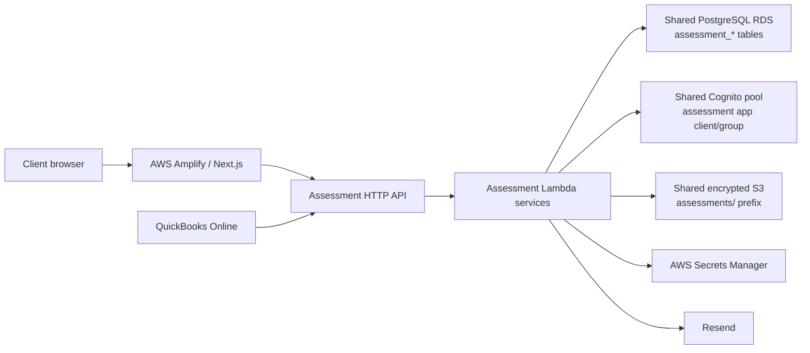

# Savians Assessments Architecture

Last updated: 2026-07-04

## Isolation model

The project reuses the approved Savians AWS foundation while creating assessment-specific logical resources:

- Dedicated Amplify application and production domain.
- Dedicated assessment HTTP API. This avoids modifying Referral Portal routes and CORS policy.
- Dedicated Cognito app client and `ASSESSMENT_CLIENT` group inside the shared user pool.
- Ten Lambda functions named `savians-assessment-{environment}-{service}`.
- PostgreSQL physical tables beginning with `assessment_`.
- S3 objects restricted to `assessments/`.
- Assessment-specific Secrets Manager secret per environment.

Shared resources are RDS, VPC/private subnets, security groups, Cognito user pool, encrypted S3 bucket, KMS key, and Resend account.

## Deployable units

### Frontend

- Next.js 15 App Router, React 19, TypeScript, Tailwind CSS.
- TanStack Query, React Hook Form, Zod, and Cognito client library.
- GitHub is the source for AWS Amplify deployment.
- Browser code receives public API/Cognito identifiers only.

### Backend

- Node.js 20 Lambda runtime with TypeScript.
- API Gateway HTTP API and Cognito JWT authorizer.
- Prisma/PostgreSQL data model.
- CDK is the only backend deployment mechanism.
- QuickBooks, database, Resend, signing, and token values are server-side secrets.

## Service boundaries

| Service | Responsibility |
| --- | --- |
| public | Health, start assessment, and recovery entry |
| agreement | Agreement display/signature evidence |
| quickbooks | OAuth and server-side QuickBooks client |
| payment | Invoice/status/verification |
| auth | Paid invitation and account linking |
| portal | Profile, household, property, and business intake |
| documents | Entitlement-gated S3 uploads |
| notifications | Resend templates and delivery tracking |
| webhook | QuickBooks signature validation and event intake |
| scheduler | Backup payment reconciliation and retention jobs |

Phase 1 creates distinct functions using a common foundation handler. Each feature phase replaces the reserved behavior with service-specific controllers and tests.

## Safety boundaries

- No invoice is created before a versioned agreement is accepted.
- No account is created before payment is verified server-side.
- No document URL is issued without authenticated paid entitlement.
- No Lambda receives raw secrets in a synthesized template.
- No migration is applied without reviewing generated SQL against the shared RDS database.
- Scheduled payment reconciliation is deployed disabled until the QuickBooks flow passes staging.

